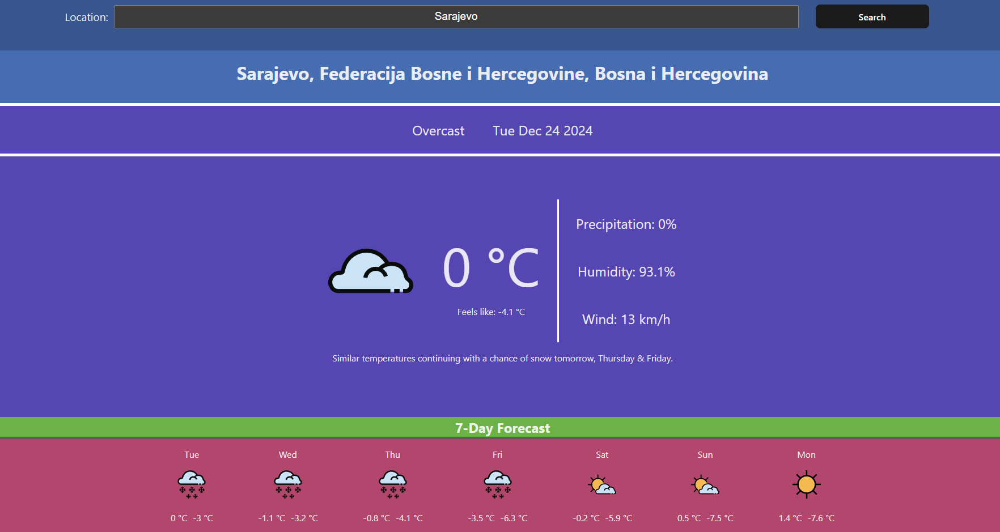

# Weather Forecast

You can try the project here: 
https://weather-forecast-579q90un1-berinmadzaks-projects.vercel.app/

A Weather Forecast application built with **Vite** and **React**. The app allows the user to insert a location and it displays current weather data and a 7-day weather forecast. The weather data is obtained using the **Visual Crossing Weather API**.

## Features
- **Current Weather**: Displays key weather metrics such as temperature, precipitation, humidity, wind speed and weather conditions.
- **7-Day Forecast**: Shows a 7-day forecast with information on weather conditions and minimum and maximum temperatures.
- **User Input Location**: Allows the user to input a location
- **Responsive Design**: Adapts to various screen sizes

## Tech Stack
- **Frontend**: React, Vite, CSS, JavaScript
- **API**: Visual Crossing Weather API
- **Deployment**: Vercel
- **Version Control**: Git, GitHub

## Screenshots



## Setup and Installation

### Prerequisites
- **Node.js**
- **npm**

### 1. Clone the Repository
```bash
git clone https://github.com/BerinMadzak/Weather-Forecast.git
cd Weather-Forecast
```

### 2. Install Dependencies
```bash
npm install
```

### 3. Set up Environment Variables
Create a `.env` file in the root of the project and add your Visual Crossing API key:
```
VITE_WEATHER_KEY=your_key
```

### 4. Run the development server
```bash
npm run dev
```

